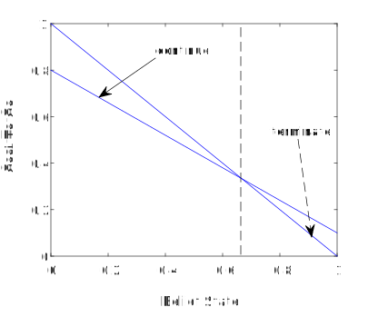
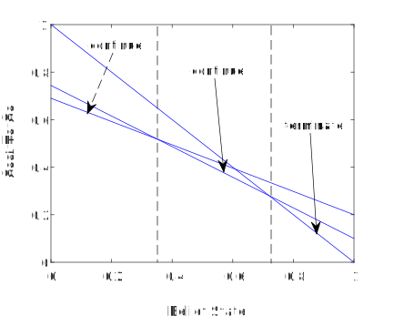
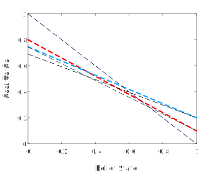
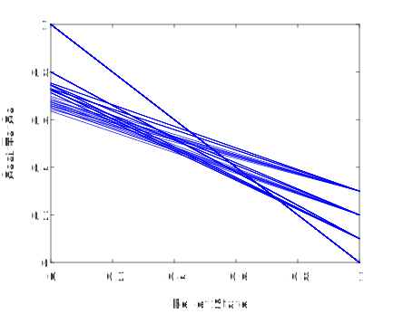
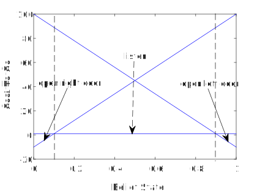
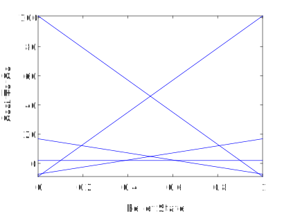
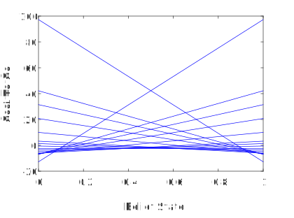
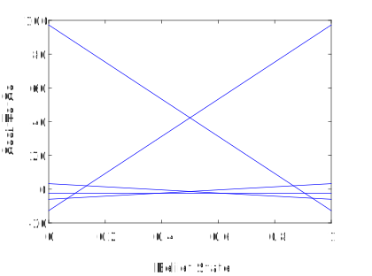

# Exact POMDP Algorithms: a functional programming approach
This code finds exact solutions to partially observed Markov decision processes (POMDPs). 

The computational complexity of POMDPs is PSPACE-hard in general, so exact solution methods are unlikely to be tractable for general cases. However, it is still possible and worthwhile to find exact solutions to small problems that either have few observations or short horizons. 

Exact algorithms construct the cost-to-go function for a belief state from a finite set of hyperplanes. Functional programming provides a simple way to implement this construction, and makes algorithm correctness almost self-evident. Here, I use the old-school functional programming language `Standard ML` because it has a very simple syntax and is easy to use. `Standard ML` is also a non-strict functional language, allowing a `C` library to be called when an LP (linear program) is required as part of the construction. A good text for `Standard ML` (and functional programming more generally) is the one by Paulson: [ML for the working programmer](https://www.cl.cam.ac.uk/~lp15/MLbook/pub-details.html), which is also free online.

Exact POMDP algorithms are nicely reviewed in Cassandra's 1998 PhD thesis, which is available here: [Cassandra_Thesis@CS.Brown_Link1](https://cs.brown.edu/media/filer_public/95/8f/958fcbaf-4f88-45fc-8f85-f1372123b0ec/cassandra.pdf), and here: [Cassandra_Thesis@CS.Brown_Link2](https://cs.brown.edu/research/ai/pomdp/papers/thesis-dbl.ps.gz). The code implementations in this repository are developed from Chapters 2 and 3, and correspond to the "batch enumeration algorithm" on Page 81. It would be straightforward to extend this implementation to the "incremental pruning algorithm" given on Page 83. 

## Building and Running the Code
To build and run this code requires installation of the following: 

1. The `SML` compiler `MLton`,
2. a `C` compiler such as `GCC`,
3. a `C` LP library such as `GLPK`,
4. an `SML` interpreter such as `SML/NJ`,
5. a plotting package such as `Matlab` or `GNU Octave`.

However, a minimal installation of an `SML` interpreter will allow all of the first example, and most of the second example, to be run. 

Once 1-5 have been installed, typing `make` and `./exact-pomdp-import` will compile and run the code. If you have `Matlab` or `GNU Octave`, running the file `exact_pomdp_plot.m` will then produce a plot.

Alternatively, typing `use "exact-pomdp-simple.sml";` on the command line of an `SML` interpreter will run a simplified version of this code. Then running `exact_pomdp_plot.m` will produce a plot.

## Examples
### 1. Instruction
This example is taken from Example 4.3.3, "Dynamic Programming and Optimal Control" (4th Ed) by Bertsekas. The two available controls are "continue instruction" and "terminate instruction". Edit Line 156 of `exact-pomdp-simple.sml` as

`val Gamout = iterate(Gamstart, 1);`

to iterate the first time period, corresponding to one session of instruction, and then run the code and the plot. This leads to the following plot.

 

The belief state is the probability a task has been learned after a number of sessions of instruction (in this case, after one session of instruction). If this probability is below the threshold (dashed line), then the optimal control leading to the lowest cost-to-go is "continue instruction". If this probability is above the threshold, the optimal control is "terminate instruction". 

Iterating the first two time periods, corresponding to two sessions of instruction,  

`val Gamout = iterate(Gamstart, 2);`

then running the code and the plot, leads to this plot.

With two sessions of instruction, the probability threshold between "continue instruction" and "terminate instruction" has increased. This is a general feature of this example as the number of sessions increases, before the threshold converges to some fixed value of the belief state. The cost-to-go for choosing "continue" may also become smaller with increase in the number of instruction sessions. The reason is the next value of the belief state will increase by choosing "continue instruction", leading to a smaller cost-to-go at the next time period. This can be confirmed by evaluating `Eval.beliefStep("continue","correct") [0.0,1.0];` in the `SML` interpreter. The last argument is the simplex of our belief state. The evaluation gives `val it = [0.416666666667,0.583333333333] : real list`, so `belief state = 0` goes to `belief state = 0.4167` after one instruction session. This pattern continues with further evaluations as the belief state tends towards 1. However, choosing "continue" and "incorrect" will lead to `belief state = 0`, no matter what the current value of the belief state.

Removing the ` Prune.dominationCheck()` function on Line 153 leads to this plot.

The simple domination check function has removed two superfluous vectors (the red and blue dashed lines) that contribute nothing to the final cost-to-go function. Removing ` Prune.dominationCheck()` for three sessions of instruction makes it clear that  POMDP complexity grows quickly, as shown in this plot.

### 2. Tiger
The second example is taken from Page 32 of [Cassandra_Technical_Report@CS.Brown_Link](https://cs.brown.edu/research/ai/pomdp/papers/cs-94-14.ps.gz). There are two closed doors; behind one door is a tiger, behind the other door is a treasure. The belief state is chosen to be the probability the tiger is behind the right door. The controls are "open left door", "open right door", and "listen". Listening will increase our knowledge about which door the tiger is behind. 

Edit Lines 147 and 149 of `exact-pomdp-simple.sml` to change the problem from "Instruction" to "Tiger":

`val Gamstart = Tiger.term_cost;`

`structure Eval = PomdpStep (Tiger);`

then run the code for one time period; i.e., `iterate(Gamstart, 1)`. This leads to the following plot.

If the belief state has a small value (below the left dashed line), the probability the tiger is behind the right door is small, so the optimal control is "open right door". If the belief state has a large value (above the right dashed line), the tiger has a high probability of being behind the right door, and the optimal policy is "open left door". If the belief state has a value between the two dashed lines, then it is not clear which door the tiger is behind, and the optimal control is "listen".  

Running the code for two time periods; i.e., `iterate(Gamstart, 2)` leads to the following plot.

There are now five vectors (hyperplanes) contributing to the cost-to-go. Looking at the data file `output.dat`, it becomes clear that all vectors correspond to the optimal control "listen". The reason is due to the problem design. If there are two time periods, listening for one time period will lead to a more certain control for the next time period. For example, we can map a belief state value from the second time period to the first time period by evaluating 
`Eval.beliefStep("listen","tiger-left") [0.2,0.8];` to get `val it = [0.0422535211268,0.957746478873] : real list`. This means `belief state = 0.2` at the second time period goes to `belief state = 0.042` at the first time period if we observe (with some measurement error) "tiger-left" from listening; and from the first figure, we see that the optimal control is "open right door" because we are fairly sure the tiger is behind the left door. If we instead evaluate `Eval.beliefStep("listen","tiger-left") [0.5,0.5];` to get `val it = [0.15,0.85] : real list`, then `belief state = 0.5` at the second time period goes to `belief state = 0.15` at the first time period, and we now have the optimal control "listen" because we are less sure the tiger is behind the left door.

Running the code for four time periods leads to the following plot.

Now we switch to the compiled code by editing the file `exact-pomdp-import.sml`. This code has the more sophisticated "pruning" method involving LPs, and can eliminate some of the redundant vectors in this figure. Running this code for four time periods leads to the following plot.

Clearly, many of the vectors (hyperplanes) in the previous figure were redundant, and five vectors are sufficient to construct the cost-to-go function. 

This completes the code demonstration for these two examples.
